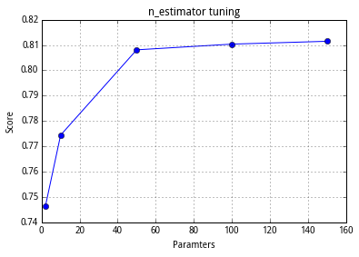
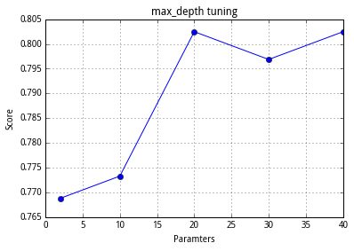
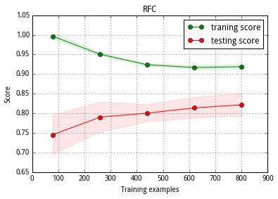

1.前言
------

今天是大年三十了，提前祝大家狗年快乐！放假回家一直没好好学习!\_!，今天强行逼自己早起做完了实验。本次实验主要学习集成学习的随机森林算法，参数调节，并解决上一次实验当中遇到的过拟合问题。我们将继续使用
Python sklean 机器学习工具。难度适中，需要大家有一定的基础。

2.实验
------

2.1 决策树
~~~~~~~~~~

学习随机森林算法，首先需要了解决策树。这里可以参考
通俗易懂之决策树。以下知识点需要大家提前理解：

决策树的属性选择：划分属性时，在当前节点下，在属性集合中，选择最优的属性。
决策树的深度 n 对学习器性能的影响: n
太小有欠拟合风险，太大有过拟合风险。 划分选择算法： gini（基尼） 以及
entropy（熵）。 ### 2.2 集成学习
集成学习就是构建并结合多个个体学习器（称为基学习器））来完成学习任务。举一个例子。下表中√
表示分类正确，×表示分类错误。

+--------------------+-----------+-----------+-----------+
|                    | 学习器1   | 学习器2   | 学习器3   |
+====================+===========+===========+===========+
| h1                 | √         | √         | √         |
+--------------------+-----------+-----------+-----------+
| h2                 | ×         | √         | √         |
+--------------------+-----------+-----------+-----------+
| h3                 | √         | ×         | √         |
+--------------------+-----------+-----------+-----------+
| 集成（提升性能）   | √         | √         | √         |
+--------------------+-----------+-----------+-----------+

+--------------------+-----------+-----------+-----------+
|                    | 学习器1   | 学习器2   | 学习器3   |
+====================+===========+===========+===========+
| h1                 | √         | √         | √         |
+--------------------+-----------+-----------+-----------+
| h2                 | ×         | √         | √         |
+--------------------+-----------+-----------+-----------+
| h3                 | √         | ×         | √         |
+--------------------+-----------+-----------+-----------+
| 集成（不起作用）   | √         | √         | ×         |
+--------------------+-----------+-----------+-----------+

\|\| 学习器1 \| 学习器2 \| 学习器3 \| \| ------------- \|-------------\|
-----\|--\| \| h1 \| √ \| √ \| √ \| \| h2 \| × \| √ \| √ \| \| h3 \| √
\| × \| √ \| \|集成（起负作用）\|×\|×\|×\|
由上面三个表，我们看到集成学习器是通过少数服从多数的原则来进行分类结果的最终选择，这就要求我们的基学习器具有第一个表的特性：性能好，并且不一样（即好而不同）。随着基学习器数目的增加，集成的错误率剧烈下降直至为0。

2.3 随机森林
~~~~~~~~~~~~

随机森林以决策树为基学习器。但是属性选择与决策树不同。随机森林中，基决策树学习器在每个节点上，从该节点的属性集合中随机选择包含K个属性的子集，再从子集中选择最优属性用于划分。这就满足“好而不同”的条件。随机森林计算开销小，是现在机器学习算法当中水平较高的算法。

2.4 Python sklearn 参数调节
~~~~~~~~~~~~~~~~~~~~~~~~~~~

RandomForest参数

\|参数\| \|特点\| \|--\|--\|--\| \|n\_estimators \|
基学习器数目（默认值10）\|基本趋势是值越大精度越高 ，直到达到一个上限
\|criterion \| 选择算法 gini 或者 entropy (默认 gini)\| 视具体情况定
\|max\_features\|子集的大小，即k值（默认 sqrt(n\_features)）\| \|
\|max\_depth \|决策树深度
\|过小基学习器欠拟合，过大基学习器过拟合。粗调节 \|max\_leaf\_nodes
\|最大叶节点数（默认无限制） \|粗调节 \|min\_samples\_split
\|分裂时最小样本数，默认2 \|细调节,越小模型越复杂 \|min\_samples\_leaf
\|叶节点最小样本数，默认2 \|细调节，越小模型越复杂 \|bootstrap
\|是否采用自助法进行样本抽样（默认使用） \|决定基学习器样本是否一致
在以上参数中，只有 n\_estimators
对精度的影响是单调的。粗调节表示参数选择跨度大，以10、100等为单位。细调节参数选择跨度小，以1、2等为单位。

2.5 代码实现
~~~~~~~~~~~~

我们首先调节：n\_estimators，max\_depth。首先观察特征数目，这决定了
max\_depth 等参数的范围。然后使用交叉验证法调参。

得到最优参数n\_estimators=100，max\_depth=10。

.. code:: python

    import pandas as pd
    import numpy as np
    import matplotlib as plt
    %matplotlib inline 
    from sklearn.ensemble import AdaBoostClassifier
    from sklearn.ensemble import RandomForestClassifier
    from sklearn.model_selection import cross_val_score
    
    data = pd.read_csv('data/数据分析(三).csv')
    data.head(5)

.. raw:: html

    

    <table border="1" class="dataframe">
      <thead>
        <tr style="text-align: right;">
          <th></th>
          <th>Unnamed: 0</th>
          <th>Survived</th>
          <th>Sex</th>
          <th>Age</th>
          <th>SibSp</th>
          <th>Parch</th>
          <th>Fare</th>
          <th>Pc_1</th>
          <th>Pc_2</th>
          <th>Pc_3</th>
          <th>...</th>
          <th>T_SOPP</th>
          <th>T_SOTONO2</th>
          <th>T_SOTONOQ</th>
          <th>T_SP</th>
          <th>T_STONO</th>
          <th>T_STONO2</th>
          <th>T_SWPP</th>
          <th>T_WC</th>
          <th>T_WEP</th>
          <th>T_X</th>
        </tr>
      </thead>
      <tbody>
        <tr>
          <th>0</th>
          <td>0</td>
          <td>0</td>
          <td>0</td>
          <td>22</td>
          <td>1</td>
          <td>0</td>
          <td>1.981001</td>
          <td>0</td>
          <td>0</td>
          <td>1</td>
          <td>...</td>
          <td>0</td>
          <td>0</td>
          <td>0</td>
          <td>0</td>
          <td>0</td>
          <td>0</td>
          <td>0</td>
          <td>0</td>
          <td>0</td>
          <td>0</td>
        </tr>
        <tr>
          <th>1</th>
          <td>1</td>
          <td>1</td>
          <td>1</td>
          <td>38</td>
          <td>1</td>
          <td>0</td>
          <td>4.266662</td>
          <td>1</td>
          <td>0</td>
          <td>0</td>
          <td>...</td>
          <td>0</td>
          <td>0</td>
          <td>0</td>
          <td>0</td>
          <td>0</td>
          <td>0</td>
          <td>0</td>
          <td>0</td>
          <td>0</td>
          <td>0</td>
        </tr>
        <tr>
          <th>2</th>
          <td>2</td>
          <td>1</td>
          <td>1</td>
          <td>26</td>
          <td>0</td>
          <td>0</td>
          <td>2.070022</td>
          <td>0</td>
          <td>0</td>
          <td>1</td>
          <td>...</td>
          <td>0</td>
          <td>0</td>
          <td>0</td>
          <td>0</td>
          <td>0</td>
          <td>1</td>
          <td>0</td>
          <td>0</td>
          <td>0</td>
          <td>0</td>
        </tr>
        <tr>
          <th>3</th>
          <td>3</td>
          <td>1</td>
          <td>1</td>
          <td>35</td>
          <td>1</td>
          <td>0</td>
          <td>3.972177</td>
          <td>1</td>
          <td>0</td>
          <td>0</td>
          <td>...</td>
          <td>0</td>
          <td>0</td>
          <td>0</td>
          <td>0</td>
          <td>0</td>
          <td>0</td>
          <td>0</td>
          <td>0</td>
          <td>0</td>
          <td>1</td>
        </tr>
        <tr>
          <th>4</th>
          <td>4</td>
          <td>0</td>
          <td>0</td>
          <td>35</td>
          <td>0</td>
          <td>0</td>
          <td>2.085672</td>
          <td>0</td>
          <td>0</td>
          <td>1</td>
          <td>...</td>
          <td>0</td>
          <td>0</td>
          <td>0</td>
          <td>0</td>
          <td>0</td>
          <td>0</td>
          <td>0</td>
          <td>0</td>
          <td>0</td>
          <td>1</td>
        </tr>
      </tbody>
    </table>
    
5 rows × 52 columns

    

.. code:: python

    y = data['Survived']
    X = data.drop(['Survived'],axis=1).values

.. code:: python

    from sklearn.model_selection import learning_curve
    import matplotlib.pyplot as plt
    
    def para_tune(para, X, y): #
        clf = RandomForestClassifier(n_estimators=para) #n_estimators 设置为 para
        score = np.mean(cross_val_score(clf, X, y, scoring='accuracy'))
        return score
    
    
    def accurate_curve(para_range, X, y, title):
        score = []
        for para in para_range:
            score.append(para_tune(para, X, y))
        plt.figure()
        plt.title(title)
        plt.xlabel('Paramters')
        plt.ylabel('Score')
        plt.grid()
        plt.plot(para_range, score, 'o-')
        return plt
    
    def plot_learning_curve(estimator, title, X, y, cv=10,
                            train_sizes=np.linspace(.1, 1.0, 5)):#定义函数 plot_learning_curve 绘制学习曲线。
        #train_sizes 初始化为 array([ 0.1  ,  0.325,  0.55 ,  0.775,  1.   ]),cv 初始化为 10，以后调用函数时不再输入这两个变量
        plt.figure()
        plt.title(title)#设置图的 title
        plt.xlabel('Training examples')#横坐标
        plt.ylabel('Score')#纵坐标
        train_sizes, train_scores, test_scores = learning_curve(estimator, X, y, cv=cv,
                                                                train_sizes=train_sizes)
        #使用 10 折交叉验证法，对 train_sizes*m（m为总的样例数目） 个的数据进行训练，返回训练精度 train_scores,测试精度 test_scores 
        train_scores_mean = np.mean(train_scores, axis=1)#计算平均值
        train_scores_std = np.std(train_scores, axis=1)#计算标准差
        test_scores_mean = np.mean(test_scores, axis=1)
        test_scores_std = np.std(test_scores, axis=1)
        plt.grid()#设置背景的网格
    
        plt.fill_between(train_sizes, train_scores_mean - train_scores_std,
                         train_scores_mean + train_scores_std,
                         alpha=0.1, color='g')#设置颜色
        plt.fill_between(train_sizes, test_scores_mean - test_scores_std,
                         test_scores_mean + test_scores_std,
                         alpha=0.1, color='r')
        plt.plot(train_sizes, train_scores_mean, 'o-', color='g',
                 label='traning score')#绘制训练精度曲线
        plt.plot(train_sizes, test_scores_mean, 'o-', color='r',
                 label='testing score')#绘制测试精度曲线
        plt.legend(loc='best')
        return plt
    
    g = accurate_curve([2, 10, 50, 100, 150], X, y, 'n_estimator tuning')

.. code:: python

    g = accurate_curve([2, 10, 20, 30, 40], X, y, 'max_depth tuning')

2.6 Sklearn 自动调参函数 GridSearchCV
~~~~~~~~~~~~~~~~~~~~~~~~~~~~~~~~~~~~~

接下来我们使用这个函数来选择最优的学习器，并绘制上一节实验学到的学习曲线。

观察学习曲线，训练精度随样例数目增加而减小，测试精度则增加，过拟合程度降低。并且从学习曲线的变化趋势看，测试精度将随着训练样例的数目的增加而进一步增加。实际上，决策树的深度以及基学习器的数目起主要的作用。

.. code:: python

    from sklearn.model_selection import GridSearchCV
    
    clf = RandomForestClassifier()
    para_grid = {'max_depth': [10], 'n_estimators': [100], 'max_features': [1, 5, 10], 'criterion': ['gini', 'entropy'],
                 'min_samples_split': [2, 5, 10], 'min_samples_leaf': [1, 5, 10]}#对以上参数进行网格搜索
    gs = GridSearchCV(clf, param_grid=para_grid, cv=3, scoring='accuracy')
    gs.fit(X, y)
    gs_best = gs.best_estimator_ #选择出最优的学习器
    gs.best_score_ #最优学习器的精度
    
    g = plot_learning_curve(gs_best, 'RFC', X, y)#调用实验2中定义的 plot_learning_curve 绘制学习曲线

.. parsed-literal::

    /opt/conda/lib/python3.4/site-packages/matplotlib/collections.py:590: FutureWarning: elementwise comparison failed; returning scalar instead, but in the future will perform elementwise comparison
      if self._edgecolors == str('face'):

3 实验总结
----------

本次实验学习了随机森林算法以及 sklearn
工具的使用。并且通过参数调节，缓解了过拟合现象。现在一个数据分析到模型选择和调优的大体流程已经，走过一遍了，接下来我们会尝试学习更多的其他机器学习算法。

